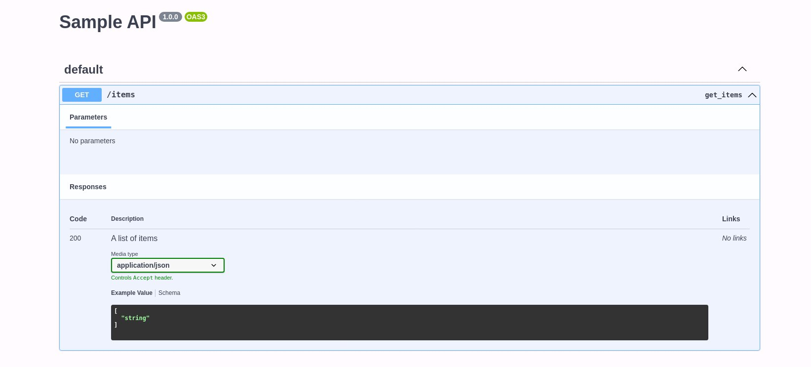

[](https://github.com/Dhali-org/swagger_documentation_widget/actions/workflows/firebase-hosting-pull-request.yml)[](https://github.com/Dhali-org/swagger_documentation_widget/actions/workflows/generate-documentation.yml)[](https://github.com/Dhali-org/swagger_documentation_widget/actions/workflows/lint.yml)[](https://github.com/Dhali-org/swagger_documentation_widget/actions/workflows/test.yml)
# Swagger Documentation Widget

<p align="center">
  
</p>

A Flutter widget for displaying Swagger/OpenAPI documentation within your app. This widget enables the integration of interactive API documentation using Swagger UI in a Flutter application. It does not require an active endpoint, all you need is a static json file containing your openAPI specification.

## Features

- Display Swagger/OpenAPI documentation using Swagger UI.
- Interactive exploration of API endpoints.
- Supports OpenAPI JSON specifications.
- Customizable UI for documentation.

## Getting Started

To use this package, add `swagger_documentation_widget` as a dependency in your `pubspec.yaml` file.

## Usage

You can use the `SwaggerDocumentationWidget` in your Flutter app like so:

```dart
SwaggerDocumentationWidget(
  jsonContent: 'Your OpenAPI JSON string here',
  title: 'API Documentation',
  // Other optional parameters
)
```

You can view full class documentation [here](https://dhali-org.github.io/swagger_documentation_widget/).

## Additional Information
For more detailed usage, examples, and customization, refer to the `/lib/main.dart'` example in this package. If you encounter any issues or have feature requests, please file them in the project's issue tracker. Contributions to the package are welcome!

For more information on using and creating Flutter packages, refer to the Flutter documentation on [developing packages and plugins](https://flutter.dev/developing-packages).